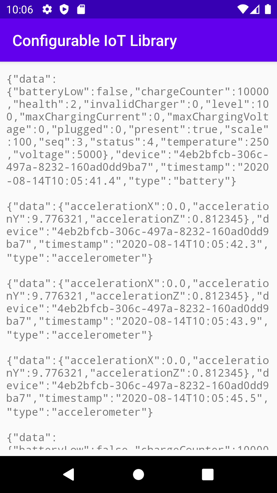

# Configurable IoT Library for Android
This library is intended for a fast set-up of real data collection and export from the various sensors available on the Android device to different destinations.

## Concepts

### Collectors
A [collector](library/base/src/main/java/me/vinsce/ciotl/collectors/Collector.java) uses device sensor or other data source to collect [sample](library/base/src/main/java/me/vinsce/ciotl/model/samples/Sample.java)s and notify all the [subscribers](library/base/src/main/java/me/vinsce/ciotl/collectors/CollectorListener.java) of the newly collected sample.

#### Built-in collectors
- [AccelerometerCollector](library/base/src/main/java/me/vinsce/ciotl/collectors/AccelerometerCollector.java): collects samples from the accelerometer sensor
- [AmbientTemperatureCollector](library/base/src/main/java/me/vinsce/ciotl/collectors/AmbientTemperatureCollector.java): collects samples from the ambient temperature sensor
- [BatteryCollector](library/base/src/main/java/me/vinsce/ciotl/collectors/BatteryCollector.java): collects samples from the device battery (voltage, level, etc.)
- [GpsCollector](library/base/src/main/java/me/vinsce/ciotl/collectors/GpsCollector.java): collects samples from the GPS
- [LightCollector](library/base/src/main/java/me/vinsce/ciotl/collectors/LightCollector.java): collects samples from the light sensor

##### Using built-in collectors
```java
AccelerometerCollector collector = new AccelerometerCollector(activity, 1000);
collector.addListener(this::onValueCollected);
collector.start();
...
collector.stop();
```

### Exporters and Encoders
An [exporter](library/base/src/main/java/me/vinsce/ciotl/exporters/Exporter.java) receives a Sample collected from a Collector and writes it to a destination.

#### Built-in exporters
- [LogExporter](library/base/src/main/java/me/vinsce/ciotl/exporters/LogExporter.java): encodes the sample to String and writers it to Logcat
- [SocketExporter](library/base/src/main/java/me/vinsce/ciotl/exporters/SocketExporter.java): encodes the sample to byte[] writes it to a TCP Socket
- [MqttExporter](library/mqtt-exporter/src/main/java/me/vinsce/ciotl/mqtt/exporters/MqttExporter.java): encodes the sample to byte[] and sends it to an MQTT topic using the [Eclipse Paho library](https://github.com/eclipse/paho.mqtt.android)
- [HttpExporter](library/http-exporter/src/main/java/me/vinsce/ciotl/http/exporters/HttpExporter.java): encodes the sample to String and sends it to an HTTP endpoint using the Volley library

##### Using built-in exporters
```java
LogExporter exporer = new LogExporter(new JsonEncoder());
exporter.setUseGenericSamples(true);
exporter.initialize();
...
exporter.export(sample);
...
exporter.close();
```

### Pipeline
A pipeline is a simple flow of Collectors and Exporters where each sample collected from one of the collectors is exported to all exporters.

It's the simplest way to setup all the component of the library:

```java
Pipeline pipeline = new Pipeline();
pipeline.addCollector(new LightCollector(this, 5000));
pipeline.addCollector(new BatteryCollector(this));
pipeline.addExporter(new LogExporter(new JsonEncoder()));
pipeline.addExporter(new MqttExporter(new JsonByteEncoder(), this, "tcp://host:port", topic, clientName));
pipeline.start();
...
pipeline.stop();
```

### Standard vs Generic samples
The (standard) schema of the samples collected from the different collectors is different (check for example [BatteryData](library/base/src/main/java/me/vinsce/ciotl/model/sensors/BatteryData.java) and [GpsData](library/base/src/main/java/me/vinsce/ciotl/model/sensors/GpsData.java)).
To simplify the job to the receivers it might help to have a common schema for all the collected samples. This is the goal of the [GenericSample](library/base/src/main/java/me/vinsce/ciotl/model/samples/GenericSample.java) and [GenericData](library/base/src/main/java/me/vinsce/ciotl/model/sensors/GenericData.java) classes.

```json
{
  "data": {
    "values": [
      { "name": "METRIC_NAME_1", "value": "X"},
      { "name": "METRIC_NAME_N", "value": 0.0}
    ]
  },
  "device": "DEVICE_ID",
  "timestamp": "yyyy-MM-dd'T'HH:mm:ss.S",
  "type": "PACKET_TYPE"
}
```

All the built-in exporters have a `setUseGenericSamples(boolean)` method (provided by the [AbstractExporter](library/base/src/main/java/me/vinsce/ciotl/exporters/AbstractExporter.java) class). If set to true, all the samples are converted to the generic schema before export.



### Extending the library
#### Custom collector
TODO
#### Custom exporter
TODO
#### Custom encoder
TODO
 
## Using the library in your project
This library is currently published in Github Package Registry.
To use it in you Android project, in your `build.gradle`:

1. Add GPR repository with your GitHub credentials
```groovy
repositories {
    maven {
        url uri("https://maven.pkg.github.com/vinsce/android-IoTLibrary")
        credentials {
            username = "GITHUB_USERNAME"
            password = "GITHUB_TOKEN"
        }
    }
}
```

2. Add the dependency
```groovy
    implementation 'com.vinsce.ciotl:base:1.0.0-SNAPSHOT'
    implementation 'com.vinsce.ciotl:mqtt-exporter:1.0.0-SNAPSHOT'
    implementation 'com.vinsce.ciotl:http-exporter:1.0.0-SNAPSHOT'
```

## Note
This library is not ready for production use and does not care about permissions or sensors availability. The application that uses the library must take care of it.